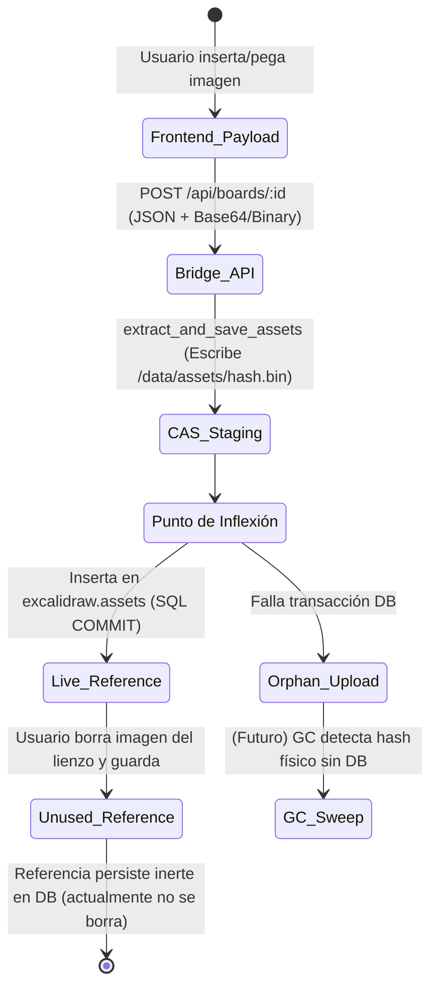

# Diseño y Auditoría del Garbage Collector del CAS (Fase 11.1)

## 1. Verificación del Quality Gate (Fase 11.0 Corregida)
* `yarn tsc`: **FAIL**. Confirmado. La compilación estricta de TypeScript detecta incompatibilidad de tipos (`Buffer` vs `BodyInit`) y ausencia de module types (`jszip`) en `phase10.test.ts`. Registrado formalmente como deuda técnica.
* `cargo check`: **PASS**.
* `yarn vitest run phase10.test.ts`: **PASS** (runner primario local v1.6.0; runner monorepo v3.0.6 presenta su propio TypeError ajeno por `jsxDEV`).

## 2. Modelo de Ciclo de Vida de Assets

## 3. Inventario de Referencias (Fuentes de Verdad)
Existen múltiples capas de referenciación en el sistema:
1. **Física:** Archivos en `data/assets/<hash>.bin`.
2. **Registro (Tracker):** Tabla `excalidraw.assets`.
3. **Uso Lógico (JSON):** 
   - Campo `elements` (Excalidraw elements con `fileId`).
   - Campo `files` (Diccionario de metadatos de Excalidraw) dentro de `excalidraw.boards`.
   - Elementos cacheados en `app_state`.

¿Puede existir una referencia lógica fuera de `excalidraw.assets`? **No productivamente**. Cualquier archivo válido utilizado por un board *debe* haber sido inyectado en `excalidraw.assets` por `extract_and_save_assets()` durante el `Save`. Sin embargo, `excalidraw.assets` es *append-only* en la arquitectura actual: los borrados lógicos desde el Frontend no borran filas de esta tabla.

## 4. Definición Formal de "Asset Vivo" (`LIVE_ASSET`)
* **Modelo A (Simple Tracker):** `LIVE = hashes en excalidraw.assets`. (Solo limpia crash uploads/restores, pero jamás borra basura lógica que el usuario eliminó del lienzo).
* **Modelo C (True Liveness):** `LIVE = Hashes extraídos del JSON (boards.elements + boards.files) donde deleted_at IS NULL`.
**Decisión para esta Arquitectura:** El **Modelo C** es la única definición correcta para un GC real de Excalidraw, dado que `excalidraw.assets` funciona meramente como un *log* de subidas históricas. Si queremos recuperar espacio de imágenes borradas, la fuente de verdad absoluta de "vida" reside en el estado JSON de los *boards activos*. 

## 5. Análisis de Estrategia `physical_assets - database_live_hashes` + `mtime > N`
La regla heurística `mtime > N` es **INHERENTEMENTE INSEGURA** por sí sola.
* **Contraejemplo Letal:** Un Asset "A" es subido y sufre crash (se vuelve huérfano). Su `mtime` envejece (ej. 3 horas). Un usuario sube *exactamente* la misma imagen. El puente detecta que ya existe físicamente y no lo sobreescribe (no actualiza el `mtime`). La transacción asíncrona de `Save` SQL inicia, pero en ese milisegundo el GC evalúa `mtime > 1h` y lo borra. La transacción hace Commit y crea una referencia a un archivo fantasma.
* **Veredicto:** `mtime > N` es una heurística válida *solo si* combinada con garantías estrictas de *Mark-and-Sweep* o si garantizamos hacer `touch` al filesystem en todo re-upload.

## 6. Relación entre GC y RwLock
* **Opción A (Read Lock):** Inseguro. Permite Save concurrente, materializando el race condition mencionado arriba.
* **Opción B (Write Lock absoluto):** Seguro, pero provoca inanición (Starvation). Congelaría todo el backend durante minutos si el escaneo del FS es masivo.
* **Decisión Óptima (Opción C - Mixta / Mark-and-Sweep):**
  - *Mark (Fase de Escaneo):* Se ejecuta **sin lock**. Lee el FS y la DB construyendo candidatos.
  - *Sweep (Fase de Borrado):* Adquiere **`write_lock`**. Vuelve a comprobar *sólo* los candidatos para asegurar que no "revivieron" (por un re-upload o un Restore encolado) y los elimina. Desbloquea rápidamente.

## 7. Atomicidad del GC y Operaciones en Vuelo
Secuencia crítica analizada:
`GC determina X muerto → Save crea referencia a X (re-upload) → GC elimina X`
Para impedir esto de forma atómica:
El GC debe realizar su Fase Final (Sweep) bajo el `state.restore_lock.write().await`. Antes de llamar a `std::fs::remove_file(X)`, el GC realiza un `SELECT` rápido comprobando si `X` resucitó en `boards.elements`/`excalidraw.assets`. Al estar bajo `write_lock`, ninguna otra petición `POST /api/boards` puede estar escribiendo a disco ni insertando en la DB en ese momento.

## 8. Mark-and-Sweep vs Direct Sweep
**Mark-and-Sweep** es mandatario. 
El *Direct Sweep* exige bloquear la escritura del servidor durante la totalidad del análisis de disco y base de datos, lo cual destruye la disponibilidad. El *Mark-and-Sweep* minimiza la ventana del `write_lock` a meros milisegundos (sólo confirmación y borrado de la lista pre-calculada de candidatos).

## 9. Dos Fases: Identificación y Eliminación
Sí. La regla absoluta debe ser:
> Un asset candidato a eliminación debe volver a demostrar que sigue siendo inalcanzable, comprobando la Base de Datos *bajo Lock Exclusivo*, inmediatamente antes de sufrir un `unlink` (borrado físico).

## 10. Failure Modes

| Fallo | DB | CAS | GC | Resultado | ¿Datos recuperables? |
| ----- | -- | --- | -- | --------- | -------------------- |
| Crash durante Scan (Mark) | Intacta | Intacto | Abortado | No se borra nada | Sí (Intacto) |
| Crash durante Sweep (Delete) | Intacta | Parcial | Abortado | Se liberó algo de espacio, quedan huérfanos | Sí (Intacto) |
| DB Unavailable en Sweep | Rechaza | Intacto | Error | El re-check falla, GC aborta sin borrar | Sí |
| Restore concurrente lanza lock | Intacta | Intacto | En espera | GC se encola respetuosamente (sin corromper Restore) | Sí |

## 11. Idempotencia
**SÍ**. `GC(GC(state)) == GC(state)`. Si se ejecuta dos veces seguidas, la segunda pasada encontrará 0 candidatos y no hará ninguna mutación, retornando un éxito inmediato.

## 12. Seguridad y Vectores de Ataque
* **Symlinks/Path Traversal:** El sistema de borrado del GC no debe construir paths ciegamente. Si un atacante inyecta `assets/deadbeef.bin` apuntando por symlink a `/etc/shadow`, el método `remove_file` borrará el symlink (no el target), pero el GC debe usar explícitamente `fs::symlink_metadata` y saltarse cualquier archivo que no sea un `FileType::is_file()` regular, para evadir edge cases POSIX.

## 13. Safety Backups y Política de Retención
Deben ser **Sistemas Separados**. 
El GC del CAS responde al ciclo de vida semántico y relacional de Excalidraw (JSON pointers vs Hashes).
La retención de backups (`data/backups/`) responde a políticas de almacenamiento (ej. *LIFO*, *Top 5 max*). Sus invariantes son mecánicos y no lógicos (no dependen de `excalidraw.boards`), por lo que mezclar ambos violaría el Principio de Responsabilidad Única.

## 14. Temporal File Cleanup
* `.restore_staging_*` y `temp_restore_*.zip` pueden ser eliminados en la Fase de *Scan* sin `write_lock`, asumiendo una heurística pasiva de `mtime > 24h`, ya que sus IDs son UUIDv4 únicos y jamás resucitan. No necesitan un ciclo complejo de liveness.

## 15. Política de Conservadurismo (La Regla de Oro)
> "GC puede eliminar X solamente si: (1) Se comprobó asíncronamente que no existe en el JSON de ningún Board activo, (2) Su antigüedad (`mtime`) supera las 24 horas, y (3) Inmediatamente antes del borrado y bajo exclusión mutua de escritura, el Hash sigue sin existir en las tablas lógicas".
Prioridad absoluta a los **Falsos Positivos**: Si la estructura JSON no puede parsearse temporalmente, se asume VIVO. 

## 16. Propuesta de Arquitectura Conceptual
1. **Dispatcher:** Invocado por CRON interno (ej. cada noche) o endpoint API autenticado.
2. **Scanner (No-Lock):** Recorre el arbol JSON de todos los Boards activos (`deleted_at IS NULL`) recolectando hashes vivos. Recorre `/data/assets/` buscando archivos con `mtime > 24h` y cuyo basename no esté en la lista viva.
3. **Sweeper (Write-Lock):** Adquiere `state.restore_lock.write().await`. Cruza los candidatos con la DB viva de nuevo. Para los validados, ejecuta `std::fs::remove_file`. Libera lock.

## 17. Criterios de Aceptación para la Futura Fase 11.2
1. Asset referenciado en Board vivo no se elimina.
2. Asset subido y abandonado (huérfano) de >24h se elimina.
3. Asset huérfano subido hace 5 minutos (posible en-flight) NO se elimina.
4. Archivo que es symlink u otro objeto maligno es ignorado/rechazado.
5. Invocar al GC durante un Restore concurrente no muta archivos que el Restore está escribiendo, y viceversa.
6. Si una tabla no puede ser decodificada, aborta el barrido.
7. Los ZIPs temporales y Staging de >24h son purgados.
8. `public.boards` se mantiene intocado, así como `schema_migrations`.

## 18. Decisión Final Respuestas

### A. ¿La arquitectura actual permite implementar GC de forma segura?
**YES**.

### B. ¿Cuál es la fuente de verdad para determinar assets vivos?
El contenido lógico (`elements`, `files`) persistido en `excalidraw.boards` para registros donde `deleted_at IS NULL`.

### C. ¿`mtime + N` es suficiente?
**NO**. Por sí solo provoca race-conditions letales si hay re-uploads o procesos pausados. Requiere `mtime + N` **Y** re-comprobación bajo *Write Lock*.

### D. ¿Debe GC usar el RwLock actual?
**SÍ**. Debe usar `write().await` exclusivamente durante la segunda fase (*Sweep*) final de borrado para paralizar concurrentemente a las APIs de mutación y Restore y evitar *phantom references*.

### E. ¿Debe existir un segundo recheck antes de borrar?
**SÍ**. Es indispensable para la protección contra *Save* en vuelo.

### F. ¿Debe existir un mecanismo adicional de protección contra operaciones en vuelo?
Solamente la combinación de `mtime > N` junto al *Sweep-Lock* es necesaria para cubrir el 100% de la ventana de exposición.

### G. ¿Asset GC y Backup Retention deben ser sistemas separados?
**SÍ**. Distinto origen de vida lógica (Relacional vs Mecánico).

### H. ¿Existe algún blocker que deba resolverse antes de implementar GC?
**NO**, pero se asume que el parseo en Rust de las columnas JSON de `elements` implicará carga de CPU y memoria; esto condicionará la implementación del Scanner.

### I. ¿Cuál debe ser exactamente el alcance de la futura Fase 11.2?
Implementar únicamente un script/módulo de *Mark-and-Sweep* para el directorio `data/assets/` y limpiezas huérfanas en `data/backups/`, sin incluir Frontend ni alterar el flujo transaccional de los endpoints actuales.
